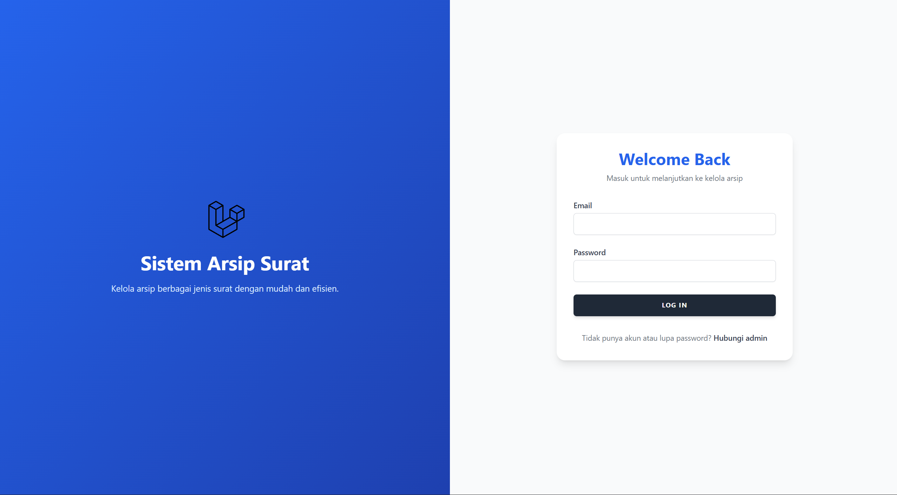
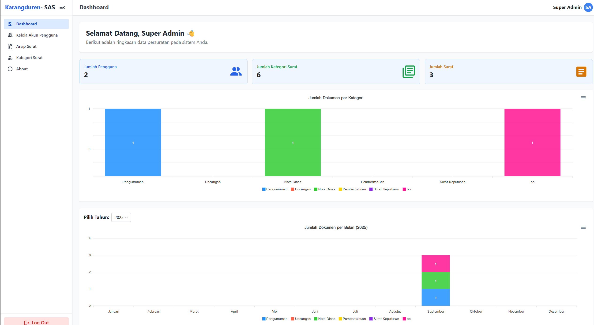
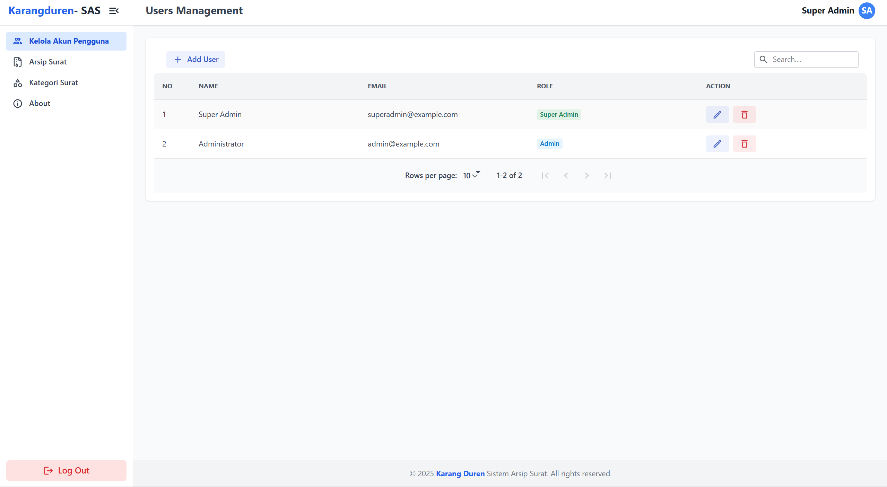
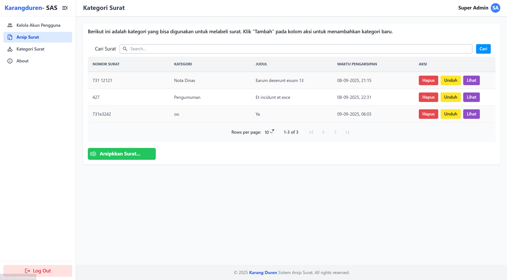
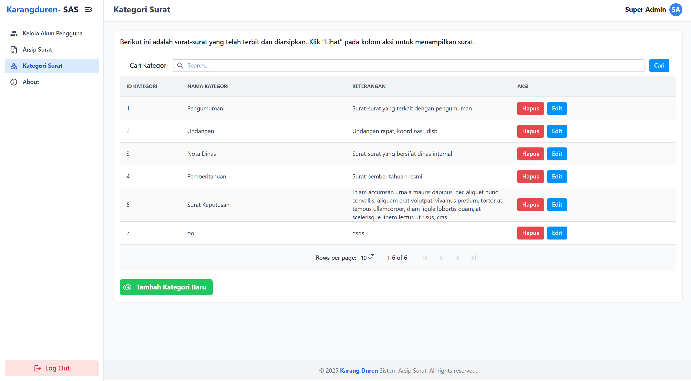
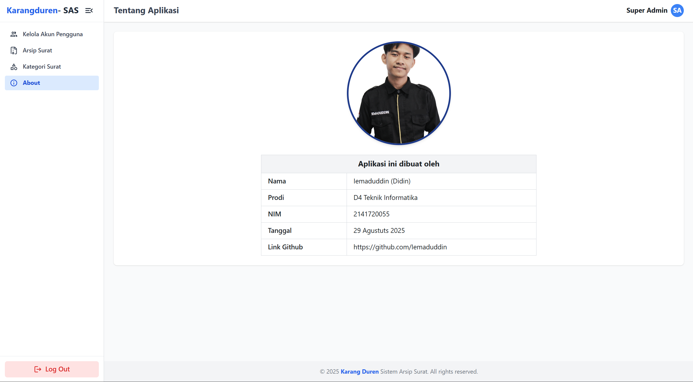

# 📑 Sistem Arsip Surat

Sistem Arsip Surat adalah aplikasi berbasis web untuk **mengelola dokumen dan surat** secara digital.  
Dikembangkan menggunakan **Laravel + Inertia.js + React + TailwindCSS**, sistem ini memudahkan pengguna dalam menyimpan, mengelompokkan, mencari, dan mengunduh dokumen dengan cepat.

---

## 🎯 Tujuan

-   Meningkatkan efisiensi dalam pengelolaan arsip surat secara digital.
-   Meminimalisir risiko kehilangan dokumen penting.
-   Mempermudah pencarian dan pengelompokan dokumen berdasarkan kategori.
-   Memberikan akses yang terkontrol melalui manajemen pengguna dan role.
-   Menyediakan dashboard interaktif untuk monitoring aktivitas dan data arsip.

---

## ✨ Fitur

-   🔐 **Autentikasi & Role User**

    -   Login & Logout
    -   Role-based Access Control (Super Admin, Admin)

-   📊 **Dashboard**

    -   Statistik jumlah user, kategori, dokumen
    -   Grafik Jumlah Dokumen per Kategori (Bar Chart)
    -   Grafik Jumlah Dokumen pert Kategori per Bulan dynamic year (Stacked Bar Chart)

-   👥 **Manajemen Data Pengguna**

    -   Tambah, ubah, hapus pengguna (user) dengan role
    -   Pencarian pengguna

-   📂 **Manajemen Kategori Surat**

    -   Tambah, ubah, hapus kategori
    -   Pencarian kategori

-   📑 **Manajemen Dokumen**

    -   Upload dokumen dengan kategori
    -   Unduh dokumen (download)
    -   Pencarian dokumen berdasarkan judul, kategori, atau nomor dokumen
    -   Tampilan tabel dokumen responsif

-   👤 **Halaman Tentang (About)**
    -   Informasi pembuat aplikasi
    -   Foto profil interaktif

---

## ⚙️ Requirement

-   PHP >= 8.2
-   Composer
-   Node.js >= 18
-   NPM / Yarn / PNPM
-   MySQL 8 / MariaDB
-   Git

## Tampilan

---

-   **Halaman Login**  
    
-   **Dashboard**  
    
-   **Kelola Data Pengguna**  
    
-   **Arsip Surat**  
    
-   **Kategori Surat**  
    
-   **About**  
    

## Teknologi yang Digunakan

-   **Backend**: Laravel
-   **Frontend**: Inertia.js, React.js
-   **Authentication-Setup**: Laravel Breeze
-   **Database**: MySQL
-   **Role Management**: Laravel Spatie
-   **CSS Framework**: Tailwind CSS
-   **Library Component**: Radix-UI
-   **Chart**: ApexCharts.js
-   **Icon**: Iconify JS

## Instalasi

Ikuti langkah-langkah berikut untuk menjalankan proyek ini di lingkungan lokal Anda:

### Prasyarat

-   PHP >= 8.1
-   Composer
-   Node.js >= 16.x
-   MySQL
-   NPM/PNPM/Yarn

### Langkah Instalasi

1. Clone repositori ini:

    ```bash
    git clone https://github.com/iemaduddin/document_archives.git
    cd repository-name
    ```

2. Instal dependensi PHP:

    ```bash
    composer install
    ```

3. Instal dependensi JavaScript:

    ```bash
    npm install
    ```

4. Salin file `.env.example` menjadi `.env`:

    ```bash
    cp .env.example .env
    ```

5. Atur konfigurasi database di file `.env`:

    ```env
    DB_CONNECTION=mysql
    DB_HOST=127.0.0.1
    DB_PORT=3306
    DB_DATABASE=nama_database
    DB_USERNAME=username
    DB_PASSWORD=password
    ```

6. Generate application key:

    ```bash
    php artisan key:generate
    ```

7. Jalankan migrasi database:

    ```bash
    php artisan migrate
    ```

8. Jalankan seeder (opsional, jika ada data awal):

    ```bash
    php artisan db:seed
    ```

9. Jalankan server pengembangan:

    ```bash
    composer run dev
    ```

Aplikasi sekarang dapat diakses di `http://localhost:8000`.

---

### Kontak

Jika Anda memiliki pertanyaan, silakan hubungi:

Email: iemaduddin17@gmail.com
